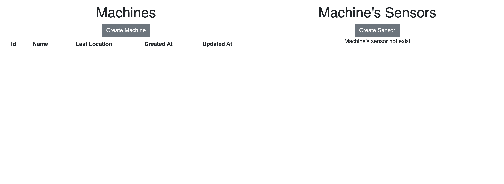

<h1 align="center">TypeScript | NodeJs | Express | GraphQL Starter Kit</h1>
 

## ❯ Table of Contents

- [❯ Table of Contents](#-table-of-contents)
  - [Pre-requisites](#pre-requisites)
- [❯ How to Run Server](#-how-to-run-server)
- [❯ How to Run Server](#-how-to-run-server-1)
- [❯ Roadmap](#-roadmap)
### Pre-requisites
You must install the following on your local machine

1. Node.js (v14.17.x recommended) 
2. Need to have postgres installed on your machine, and update the `mikro-orm.config.ts` file accordingly  

## ❯ How to Run Server
- Clone the project and navigate to the project root directory
- cd to server directory and run `npm install` or `yarn install` to install the packages.
- Once the packages install just run `npm run dev` or `yarn dev`

## ❯ How to Run Server
- Clone the project and navigate to the project root directory
- cd to client directory and run `npm install` or `yarn install` to instal the packages. 
- Once the packages install just run `npm run start` or `yarn start`

The initial screen where no machine and sensor data not exist
  

This isn the screen when you have created a machine 
  

This isn the screen when you have created a machine and its associated sensor and clicked on that machine its kind of details page
  

- The GraphQL Playground will be running on [http://localhost:8000/graphql](http://localhost:3000/graphql)

## ❯ Roadmap
- [ ] Add unit tests
- [x] Add Rate Limiter
- [X] Add CORS Policies
- [ ] Add refresh token support
- [X] Add request/input data validation
- [ ] Improve logging
- [x] Improve error handling
- [x] Add DataLoader support
- [x] Add graphql

